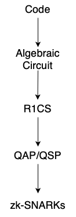
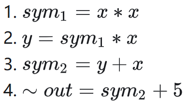
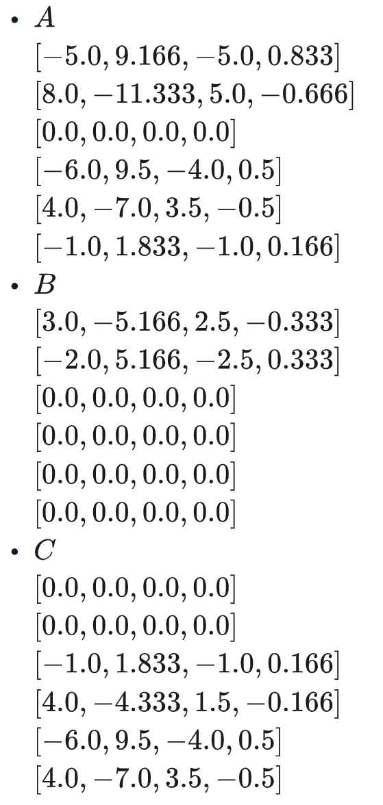
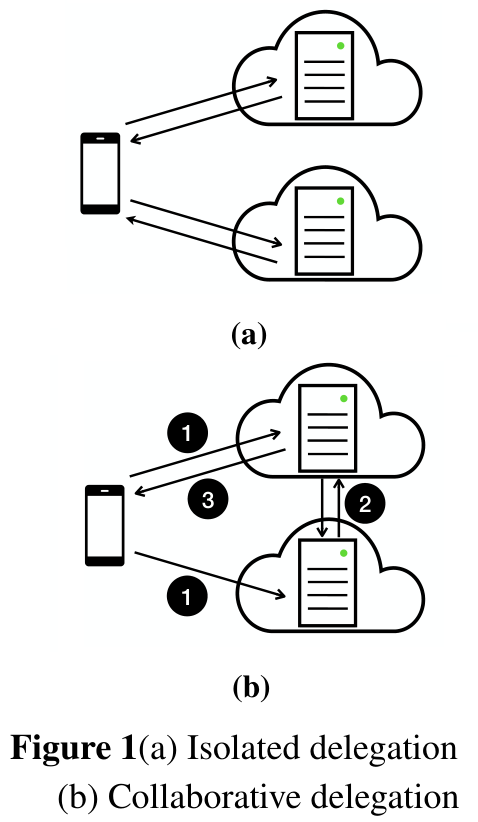
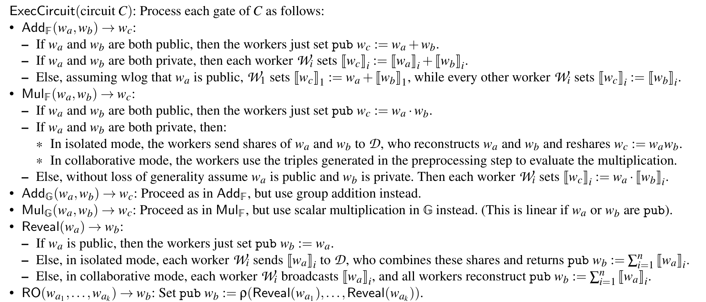
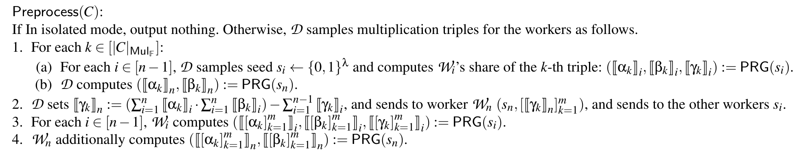
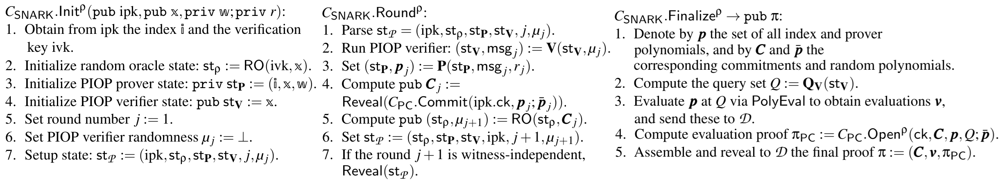
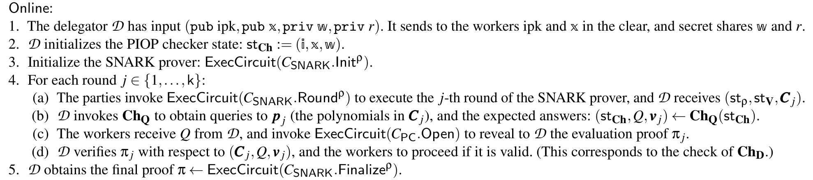
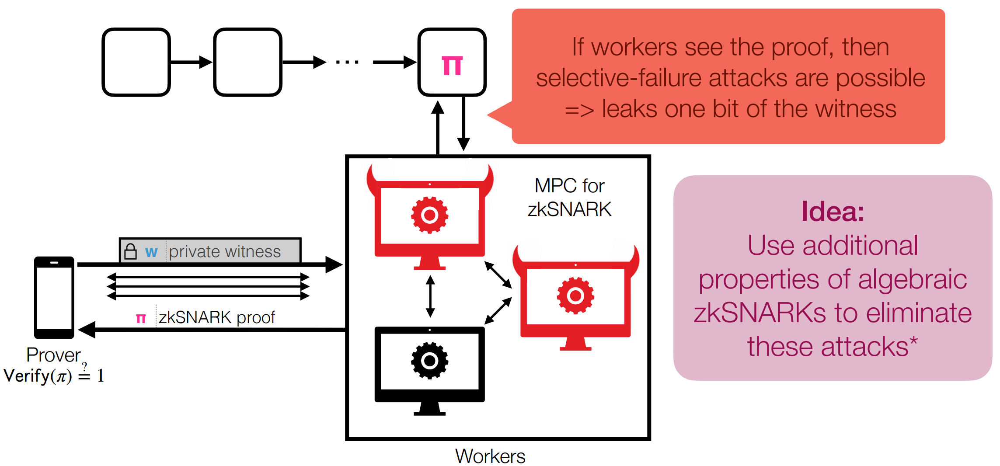

# **EOS** <br> <span style="font-size: 0.7em;">Efficient Outsourcing of SNARKs</span>

<p style="font-size: 2rem; color: black;">
Efficient Private Delegation of zkSNARK Provers
</p>

<div class="pt-6">
  Tianyi Wang<br>
  Fujian Normal University<br>
  June 31 2025
</div>


<div
  class="absolute bottom-9 left-3 text-sm text-gray-700 leading-snug font-medium"
  style="font-family: 'Noto Sans SC', 'Microsoft YaHei', sans-serif;"
>
  Reference: [1] A. Chiesa et al., Eos: Efficient Private Delegation of zkSNARK Provers, <i>USENIX Security</i>, 2023.
</div>

---
section: 通俗讲解EOS是什么
---

# **背景介绍**

零知识证明（ZKP, zero-knowledge proof）：你有一个秘密，你想向别人证明你知道这个秘密，但你又不想把秘密本身透露给对方。

zkSNARKs：Z(zero)k(knowledge)S(succinct)N(non-interactive)AR(argument)K(knowledge)，零知识简洁非交互式知识论证。

应用：

 * **保护隐私的加密货币**：可以隐藏交易的发送者、接收者和金额。

 * **保护隐私的智能合约**：可以在不泄露合约具体内容的情况下，证明合约执行的正确性。


<div
  class="absolute bottom-9 left-3 text-sm text-gray-700 leading-snug font-medium"
  style="font-family: 'Noto Sans SC', 'Microsoft YaHei', sans-serif;"
>
  Reference: [1] https://www.youtube.com/watch?v=kIdMXwua4uU (USENIX Security '23 - Eos: Efficient Private Delegation of zkSNARK Provers)
</div>

---
layout: default
---

# **为什么要有zkSNARK**

<div class="grid grid-cols-3 gap-4">
  <div class="pr-4" style="border-right: 1px dashed #718096;">

  ## 传统交互式方案

  如果没有 $\text{zkSNARK}$，使用传统 ZKP

  证明者 $\mathcal{P}$ 知道 $x$ 满足 $y = g^x \mod p$

  ---

  $\mathcal{P}$ 选择随机 $r$，计算 $t = g^r \mod p$；

  $\mathcal{P}$ 发送 $t$ 给验证者。

  验证者 $\mathcal{V}$ 发送 $\mathcal{P}$ 一个挑战 $c$。

  $\mathcal{P}$ 计算 $s = r + c·x \mod q$，发送 $s$。

  $\mathcal{V}$ 检查：$g^s \stackrel{?}{=} t·y^c \mod p$

  ---

  上述内容即为 **Schnorr协议** 过程

  </div>
  <div class="px-4" style="border-right: 1px dashed #718096;">

  ## 我想要非交互式滴

  将 $\mathcal{V}$ 的随机挑战 $c$ 改为一个固定哈希

  ---

  $\mathcal{P}$ 
  <br> 选择随机 $r$，计算 $t = g^r \mod p$；
  <br> 计算挑战：$c=H(g||y||t)$；
  <br> 计算响应：$s = r + c·x \mod q$；
  <br> 输出证明：$π = (t, s)$。
  <br> $\mathcal{V}$ 
  <br> 重新计算挑战：$c=H(g||y||t)$；
  <br> 检查是否：$g^s \stackrel{?}{=} t·y^c \mod p$。

  ---

  新增的这一步被称为 **Fiat–Shamir 变换**

  上述内容即为**非交互式 Schnorr 零知识证明（NIZK proof）** 过程

  </div>
  <div class="pl-4">

  ## 但是哈希函数怎么证明

  Schnorr 协议仅用于离散对数形式，而对其他函数（多项式或哈希函数等）无能为力

  这时就要搬出我们的 $\text{zkSNARK}$ 了~

  证明者 $\mathcal{P}$ 知道 $x$，使得 $H(x) = y$

  分为四步：（具体见第二部分）

   - 把 $H(x) = y$ 转换为一个 算术电路；

   - 编译该电路为一组约束（如 $\text{R1CS}$）；

   - 让证明者用 $x$ 生成一个零知识证明 $π$，表明 “存在一个 $x$ 使得约束成立 ”；

   - 验证者使用公开的 $y$ 和 $π$ 来验证，而无需知道 $x$。

  </div>
</div>

---

# **Eos: 高效外包SNARKs**

<div class="grid grid-cols-2 gap-4 max-h-[300px]">
  <div class="bg-blue-100 p-4">

  ## **面临的挑战**

  虽然zkSNARKs 很强大，但是生成证明的过程却非常耗时和消耗计算资源。

  * 用户自己生成证明->设备花费**很长时间**，甚至无法完成。

  * 把生成证明的任务交给云计算平台->速度快了，但用户的秘密就会**暴露**给云计算平台。

  

  </div>
  <div class="bg-green-100 p-4">

  ## **EOS 的解决方案**

  核心思想：把生成证明的任务分配给多个“工人”来共同完成。

  * **秘密分享**：用户把自己的秘密分成多份，发给不同的“工人”。只要有**一个**“工人”是诚实的，用户的秘密就不会泄露。

  * **安全验证**：EOS 设计了一种新的验证方法，可以确保“工人”们正确地执行了计算，防止他们作弊。

  

  </div>
</div>
<br>

---

# **性能瓶颈天然适配MPC（电路深度小）**

|特性|FFT(快速傅里叶变换)|MSM(多标量乘法)|
|---|---|---|
|要解决的问题|两个n次多项式的乘法|n组标量和椭圆曲线点的乘积之和|
|朴素解法的复杂度|$O(n^2)$(逐项相乘)|$O(n*k)$(逐项计算标量乘法，k为标量位宽)|
|优化思想|分治法：将问题转换到点值域，<br>O(n)完成乘法，再转换回来|批处理/分桶法：将所有标量重组，<br>一次性计算总和，复用大量中间计算|
|优化后的复杂度|$O(nlogn)$|$O(\frac{n*k}{\log n})$(Pippenger算法)|
|在zkSNARK<br>的中角色|PIOP证明者中的一个核心<br>性能瓶颈，用于多项式运算|是多项式承诺方案(PC)中的<br>一个核心性能瓶颈，用于群运算|
|电路深度|0|0|


---
section: zkSNARK基础知识
---

# **zkSNARK 是什么？**

  * 证明者可以证明自己知道某个秘密值 $w$，使得关系 $F(x,w)=1$ 成立，而无需泄露 $w$ 的任何信息。<br><br>

| 特性 | 含义 |
| ---- | ---- |
| **零知识性** <br>**(Zero-Knowledge)** | 除了"陈述为真"这一信息外，不向验证者泄露任何关于秘密 $w$ 的其他信息。 |
| **简洁性** <br>**(Succinct)** | 生成的证明非常简短，且验证过程极快，其复杂度与计算规模几乎无关。 |
| **非交互性** <br>**(Non-interactive)** | 证明过程只需一次消息传递，无需多轮交互对话。 |
| **知识论证** <br>**(Argument of Knowledge)** | 确保证明者确实"知道"符合条件的见证值 $w$，而非通过其他方式伪造证明。 |

---

# **zkSNARK的关键组件**

算法流程：

 * 将多项式先抽象成算数门（加减乘除）

 * 将算数门 “拍平” 为 $\textbf{R1CS}$ 的电路表现形式

 * 转化为 $\textbf{QAP}$ 的形式，旨在**快速验证**整个电路

 * 利用**双线性对** **隐藏**解向量 $\vec{s}$

 * 生成并输出证明
 ---

本章内容介绍的是Groth16算法的流程<br>
而非Marlin和EOS等算法<br>
差异在于将QAP替换为AHP<br>
但都需要经过R1CS转化<br>
（后面会介绍详细内容）



<div class="absolute top-28 right-20 w-[40%] scale-[0.9]" >

| 布尔门   | 对应算数操作 |
| ---     | ---         |
| A AND B | A × B       |
| A OR B  | A + B - A×B |
| NOT A   | 1 - A       |

</div>

<div class="absolute top-67 right-10 w-[18%] scale-[0.7]" >

其中 $A,B\in\{0,1\}$。

</div>


<div
  class="absolute bottom-9 left-3 text-sm text-gray-700 leading-snug font-medium"
  style="font-family: 'Noto Sans SC', 'Microsoft YaHei', sans-serif;"
>
  Reference: [1] https://zhuanlan.zhihu.com/p/38205067<br>
  &nbsp;&nbsp;&nbsp;&nbsp;&nbsp;&nbsp;&nbsp;&nbsp;&nbsp;&nbsp;&nbsp;&nbsp;&nbsp;&nbsp;&nbsp;&ensp;
  [2] https://learnblockchain.cn/article/3220<br>
  &nbsp;&nbsp;&nbsp;&nbsp;&nbsp;&nbsp;&nbsp;&nbsp;&nbsp;&nbsp;&nbsp;&nbsp;&nbsp;&nbsp;&nbsp;&ensp;
  [3] https://github.com/slowmist/zkSnark-Groth16-Getting-Started
</div>

---

# **R1CS-电路“拍平”**


<div v-click.hide>
<div class="absolute top-35 w-[40%] scale-[1]" >


R1CS：Rank-1 Constraint System，秩1约束系统

用数学等式来描述 **一个程序在输入某些值时该如何运作**

秩1：矩阵只有一个现行独立的行/列

将**一步算数门**操作等价转化为 $(\vec{a}\cdot\vec{s})*(\vec{b}\cdot\vec{s})-\vec{c}\cdot\vec{s}=0$ 

其中：
 - $\vec{a},\vec{b},\vec{c}$ 每**一步**运算都有单独的一组
 - $\vec{s}$ 被称为**解向量**，一个电路中只有一个

 - ---

举个例子：

```
s=( one ,  x  , out ,sym_1,  y  ,sym_2)
a=[  0  ,  1  ,  0  ,  0  ,  0  ,  0  ]
b=[  0  ,  1  ,  0  ,  0  ,  0  ,  0  ]
c=[  0  ,  0  ,  0  ,  1  ,  0  ,  0  ]
```

</div>
</div>

<div class="absolute top-35 right-20 w-[40%] scale-[1]" >

对于一个函数

```
def qeval(x):
    y = x**3
    return x + y + 5
```

将它拍平成以下语句：



<br><br>

$\vec{s}$ 为解向量，其结构为 $(~one,x,~out,sym_1,y,sym_2)$

对于 $x*x-sym_1=0$（即第一步），等价于

```
a=[0,1,0,0,0,0],b=[0,1,0,0,0,0],c=[0,0,0,1,0,0]
```

此时满足 $(\vec{a}\cdot\vec{s})*(\vec{b}\cdot\vec{s})-\vec{c}\cdot\vec{s}=0$

</div>

<div v-after>
<div class="absolute top-35 w-[40%] scale-[1]" >

同理可得

等式二 $sym_1*x-y=0$ $&nbsp$ 等价于

```
a=[0,0,0,1,0,0],b=[0,1,0,0,0,0],c=[0,0,0,0,1,0]
```

等式三 $(y+x)*1-sym_2=0$ $&nbsp$ 等价于

```
a=[0,1,0,0,1,0],b=[1,0,0,0,0,0],c=[0,0,0,0,0,1]
```

等式四 $(sym_2+5)*1-(~out)=0$ $&nbsp$ 等价于

```
a=[5,0,0,0,0,1],b=[1,0,0,0,0,0],c=[0,0,1,0,0,0]
```

<br>

<div class="text-xl text-center mt--7">

**证明者知道witness $\Leftrightarrow$ 每组拍平后的电路都成立**

</div>

两个问题：1. 需验证每个拍平后的式子，时间复杂度过高；<br>2. witness包含于 $\vec{s}$，我们需要隐藏它（witness即为输入）。

</div>
</div>

---

# **QAP-转为多项式，快速验证**

前置知识-拉格朗日插值法：在笛卡尔直角坐标系上，输入n个点，输出一个n次多项式（形式为$f(x)=\sum_{i=0}^na_ix^i$，其中$a_i$为每项系数）

<div class="absolute top-45 left-15 w-[40%] scale-[1]" >

把使用R1CS约束后的电路搬到这里来

```
a=[0,1,0,0,0,0],b=[0,1,0,0,0,0],c=[0,0,0,1,0,0]
a=[0,0,0,1,0,0],b=[0,1,0,0,0,0],c=[0,0,0,0,1,0]
a=[0,1,0,0,1,0],b=[1,0,0,0,0,0],c=[0,0,0,0,0,1]
a=[5,0,0,0,0,1],b=[1,0,0,0,0,0],c=[0,0,1,0,0,0]
```

把它看成一个**4行18列**的大矩阵

按列来取点，横坐标为 $i\in[1,行数]$

第一 **列** 可以取到点 `(1,0),(2,0),(3,0),(4,5)`

插值得到多项式 $f(x)=-5+9.166x-5x^2+0.833x^3$

即数列 $[-5,9.166,-5,0.833]$

同理可得总计 **18** 个类似的四元数列



</div>

<div class="absolute top-45 left-180 w-[35%] scale-[1]" >

将 $x=1$ 分别带入这18个多项式，得到

`0,1,0,0,0,0,0,1,0,0,0,0,0,0,0,1,0,0`

正好是第一个约束下的三个向量 $\vec{a},\vec{b},\vec{c}$

`(0,1,0,0,0,0),(0,1,0,0,0,0),(0,0,0,1,0,0)`

同理 $x=2,3,4$ 依次可以得到第二、三、四个约束

令 $A(x)=\vec{s}\cdot\vec{a},B(x)=\vec{s}\cdot\vec{b},C(x)=\vec{s}\cdot\vec{c}$

检验 $x=1,2,3,4$ 下 $A(x)*B(x)-C(x)=0$ 是否成立，本质是检查R1CS的四个约束是否都满足

定义 $Z(x)=(x-1)(x-2)(x-3)(x-4)$

如果 $A(x)*B(x)-C(x)$ 可以被 $Z(x)$ 整除，我们就认为其可以满足所有约束（一次计算）

</div>

---

# **双线性对-隐藏解向量s 和 生成最终证明**


<div class="absolute top-35 w-[40%] scale-[1]" >

$
\pi_a=G*A(t)\\
\pi_b=G*B(t)\\
\pi_c=G*C(t)\\
\pi_h=G*H(t)
$

要验证 $A*B-C=H*Z$

只需验证 $e(\pi_a,\pi_b)/e(\pi_c,G)=e(\pi_h,G*Z(t))$

$\pi=(\pi_a,\pi_b,\pi_c)$，$G$ 和 $Z(t)$ 为公开参数

最终证明只需将公共输入嵌入双线性映射中即可

 ---

具体算法具体构造，例如在Groth16中，需验证：

$
e(\pi_a,\pi_b)=e(\alpha ,\beta )\cdot e(\sum x_i\cdot u_i,\gamma)\cdot e(\pi_c,\delta)
$

除了承诺，其他元素皆来自 Trusted Setup，和公共输入相关

</div>

<div class="absolute top-35 right-5 w-[50%] scale-[1]" >

|元素|群域|用途|
|---|---|---|
| `α·G₁` | G1 | 用于构造证明中的 A |
| `β·G₂` | G2 | 用于构造证明中的 B |
| `γ·G₂` | G2 | 绑定公共输入 |
| `δ·G2` | G2 | 保证完整性（用来防止伪造） |
| 更多：如 `Aᵢ(s)/δ`, `Bᵢ(s)/δ`,<br> `Cᵢ(s)/δ`, `H(s)/δ` 等 | G1, G2 | Prover 用                                |


</div>

<div
  class="absolute bottom-9 left-3 text-sm text-gray-700 leading-snug font-medium"
  style="font-family: 'Noto Sans SC', 'Microsoft YaHei', sans-serif;"
>
Reference:[1] On the Size of Pairing-based Non-interactive Arguments?
</div>

---
section: Preliminaries
---

<div class="text-xl" style="transform: scale(0.9); transform-origin: top left; display: inline-block;">

# 🔍 **Comparison: EOS in zkSNARK Research vs EOS.IO Blockchain Platform**

| | EOS (zkSNARK paper) | EOS.IO (Blockchain Platform) |
|---|---|---|
| **Full Name** | Efficient Outsourcing of SNARKs | Enterprise Operation System |
| **Field** | Cryptography, zkSNARKs, Secure Computation | Blockchain Systems, Distributed Ledger |
| **Core Goal** | Privacy-preserving delegation of zkSNARK proving | High-performance, fee-free smart contract platform |
| **Open Source** | [USENIX-2023](https://www.usenix.org/conference/usenixsecurity23/presentation/chiesa) | [GitHub-EOS.IO](https://github.com/EOSIO/eos) |
| **Main Technologies** | zkSNARKs, PIOP, Polynomial Commitments, Secret Sharing | Blockchain VM, Token Economy, Resource Model |

<br>

> <span style="font-size: 1.5em; color:rgb(0, 0, 0); font-weight: 450;">
> ⚠️ Note: These two EOS projects are completely unrelated. The zkSNARK EOS is a cryptography research system; the blockchain EOS is an enterprise-grade DApp platform.
> </span>

</div>

<div
  class="absolute bottom-9 left-3 text-sm text-gray-700 leading-snug font-medium"
  style="font-family: 'Noto Sans SC', 'Microsoft YaHei', sans-serif;"
>
  Reference: [1] https://www.usenix.org/conference/usenixsecurity23/presentation/chiesa<br>
  &nbsp;&nbsp;&nbsp;&nbsp;&nbsp;&nbsp;&nbsp;&nbsp;&nbsp;&nbsp;&nbsp;&nbsp;&nbsp;&nbsp;&nbsp;&ensp;
  [2] https://github.com/EOSIO/eos
</div>

---

# **Marlin：basic of EOS**

**Marlin**: a general zkSNARK protocol based on Polynomial Interactive Proofs (PIOPs) and Polynomial Commitment Schemes (PCS).
<div class="grid grid-cols-3 gap-4">
  <div class="bg-green-100 p-4 col-span-2">

  |  | Groth16 | Marlin |
  |------|---------|--------|
  | **Trusted Setup(SRS)** | Circuit-specific and non-updateable | Universal and updateable |
  | **Proof Size** | Smaller(128 bytes over BN-256) | Larger(704 bytes over BN-256) |
  | **Prover Time** | faster | slower but comparable |
  | **Verifier Time** | Faster | 3 times slower than Groth16 |
  | **Underlying Framework** | Quadratic Arithmetic Programs(QAP) | Algebraic Holohraphic Proofs(AHP) |

  </div>
  <div class="bg-blue-100 p-4">

  **Applications in EOS**
  * Marlin's PIOP structure makes it naturally suitable for **distributed computation**
  * Polynomial operations can be efficiently **secret-shared**
  * Supports EOS's **multi-worker** collaborative proof generation
  </div>
</div>


---

# **Marlin Protocol Workflow**

<div class="grid grid-cols-3 gap-4 text-xl">
  <div class="pr-4" style="border-right: 1px dashed #718096;">

  ## Offline Preprocessing

  Circuit -> Key

  * **ipk (Indexed Proving Key)**: Contains **preprocessed polynomials** and **proving parameters** for proof generation.
  * **ivk (Indexed Verification Key)**: Contains the **circuit digest** and **verification parameters** for proof validation.

  $O(n)\rightarrow O(1)$

  </div>
  <div class="px-4" style="border-right: 1px dashed #718096;">

  ## Polynomial Commitment

  witness -> function -> commitment

  * Transform **witness** into **proof polynomials**
  * Generate polynomial commitments using $ipk$:

  Commitments cryptographically bind polynomials while preserving zero-knowledge

  </div>
  <div class="pl-4">

  ## Evaluation & Proof

  commitment -> provement($\pi$)

  Verifier sends random challenge points, prover computes:
  * Polynomial evaluations at query points: $v$
  * Batch evaluation proof: $\pi_{pc}$

  return $\pi = (C, v, \pi_{pc})$

  Ensures consistency between commitments, evaluations, and underlying polynomials

  </div>
</div>

---

# **Polynomial Commitments in Marlin**

Marlin uses the **KZG polynomial commitment scheme**, which is crucial for EOS's design:

<div class="grid grid-cols-2 gap-4">
  <div class="bg-orange-100 p-4">

  ## **Properties of KZG Commitments**

  * Homomorphism: <br> $\text{Commit}(f + g) = \text{Commit}(f) + \text{Commit}(g)$
  * Succinctness: <br> Commitment size is constant (one elliptic curve point)

  **Commitment Process**:
  
  $$
  \begin{aligned}
  &Setup: g^{τ^0}, g^{τ^1}, ..., g^{τ^d}\\
  &Commit(f): C = g^{f(τ)}\\
  &Prove(f, z): π = g^{(f(τ)-f(z))/(τ-z)}\\
  &Verify: e(C/g^{f(z)}, g) = e(π, g^{τ}/g^z)
  \end{aligned}
  $$

  </div>
  <div class="bg-purple-100 p-4">

  ## **Advantages in EOS**

  * Additivity: Secret-shared polynomials can be directly added
  * Linearity: <br> Multi-scalar multiplication can be computed distributively
  * Efficient Verification: <br> Verifier only needs to check bilinear pairing equations

  Distributed Commitment:
  
  $$
  \begin{aligned}
  &f(X) = f₁(X) + f₂(X) + ... + fₙ(X)\\
  &C = g^{f₁(τ)} · g^{f₂(τ)} · ... · g^{fₙ(τ)}
  \end{aligned}
  $$

  Each worker can independently compute their partial commitment

  </div>
</div>


---
section: Construction
---

# **Eos System Overview**

* Participants:
    * Delegator (D): Computationally weak party wishing to prove a statement.
    * Workers ($W_1, ..., W_n$): Powerful (cloud) servers performing the bulk of computation.
* Protocol Phases:
    * Preprocessing Phase: Witness-independent. Material can be pre-computed.
    * Online Phase: Witness-dependent. D sends shares of its private witness `w` and public input `x` to workers.
* Communication Modes (Fig. 1):
    * Isolated Mode: Each honest worker communicates only with D. <br>
    (Stronger security guarantees, higher communication/latency costs).
    * Collaborative Mode: Workers communicate directly with each other and with D.
* Threat Model:
    * Privacy: Witness `w` is hidden if at least one worker is honest and non-colluding.
    * Integrity: Dishonest workers can deviate arbitrarily (malicious security).
* Witness Reduction: Delegator performs witness reduction and secret shares the resulting low-level witness.




---

# **Specific algorithm-ExecCircuit**



---

# **Specific algorithm-Preprocess**

The delegator create and distribute secret-shared multiplication triples to a set of `n` workers.

These triples allows workers to securely multiply secret-shared values during the online phase without revealing private data.



<br><br><br><br><br><br><br><br><br>


1.Workers calculate `z=x*y`; 
2.Each worker calculates $d_i=x_i-a_i$ and $e_i=y_i-b_i$ and broadcasts these values.

3.Each worker calculates $d=\sum d_i$ and $e=\sum e_i$; 
4.workers have $a_i,b_i,c_i$ and they can have their $z_i$

$z=x*y=(d+a)*(e+b)=d*e+d*b+e*a+a*b=d*e+d*\sum b_i+e*\sum a_i+\sum c_i$

For the `C` multiplications in the circuit, the preprocessing phase generates `C` corresponding triple, each triple is split into `n` parts for each worker.

---

# **Specific algorithm-Online**





---
section: Conclusion
---

# **Comparison between 3 papers**

|  | **Marlin(EUROCRYPT 2020)** | **EOS(USENIX 2023)** | **Siniel(NDSS 2025)** |
| --- | --- | --- | --- |
| 贡献 | 单次Trusted Setup | 委托者将证明不泄露隐私下外包 | 在EOS基础上实现委托者完全离线 |
| 委托者操作 | 本地证明，独立完成所有计算 | 证明生成期间需保持在线并参与检查 | 仅离线准备并分发一次数据，之后无需参与任何计算或通信 |
| 安全<br>模型 | 不涉及委托，为本地计算 | 至少1个工作者诚实（加法聚合） | 超过一半工作者诚实（Shamir秘密共享聚合，门限k，工人数n=2k+1） |
| 委托者开销 | 高（独立承担所有计算和内存开销） | 中等（远低于Marlin，但受<br>网络带宽和在线交互限制） | 极低（显著低于EOS，高带宽下节省约80%时间，仅需一次性离线准备分发） |
| 工作者开销 | 无 | 高带宽下较低（通信延迟可忽略）；低带宽下很高（需等待委托者响应） | 高带宽下较高（需额外执行一致性检查）；低带宽下较低（无需等待委托者） |
| 通信<br>开销 | 无 | 较低 | 较高（Beaver三元组、认证标签和密钥等） |

---

# **Problem**



<!-- ---

# **Difference between zkSNARK & zkSTARK**

| |zkSNARK|zkSTARK|
|---|---|---|
|全称|Zero-Knowledge Succinct Non-interactive Argument of Knowledge|Zero-Knowledge Scalable Transparent Argument of Knowledge|
|可信设置|需要可信设置（TrustedSetup）|✅无需可信设置（透明）|
|数学基础|椭圆曲线密码学（如pairing-basedcryptography）|基于哈希函数（如MerkleTree、FRI），更量子安全|
|证明大小|小（几百字节）|较大（数十KB到几MB）|
|验证速度|极快|快，但比zkSNARK稍慢|
|证明生成速度|较慢（尤其对复杂电路）|更快，尤其适合大规模证明，支持大规模并行|
|量子抗性|❌不抗量子攻击|✅抗量子攻击|
|适用场景|常用于以太坊隐私协议（如Zcash、Aztec）|常用于可扩展性方案（如StarkNet、zkRollup）|
|复杂度|电路复杂性较高、工具链成熟|工具较新，电路设计更简单| -->

---
layout: center
class: text-center
---

<div class="h-6"></div>

# Thank You / Q&A

<div class="mt-6"></div>

<table class="bg-blue-50 rounded-lg shadow-sm border border-blue-100 mx-auto" style="width: 400px; max-width: 75%;">
  <tbody>
    <tr>
      <td class="px-6 py-3">
        <b>GitHub:</b> <a href="https://github.com/coperlm" class="text-blue-600">https://github.com/coperlm</a>
      </td>
    </tr>
    <tr>
      <td class="border-t border-blue-100 px-6 py-3">
        <b>Email:</b> <a href="mailto:TyWang2005@outlook.com" class="text-blue-600">TyWang2005@outlook.com</a>
      </td>
    </tr>
  </tbody>
</table>